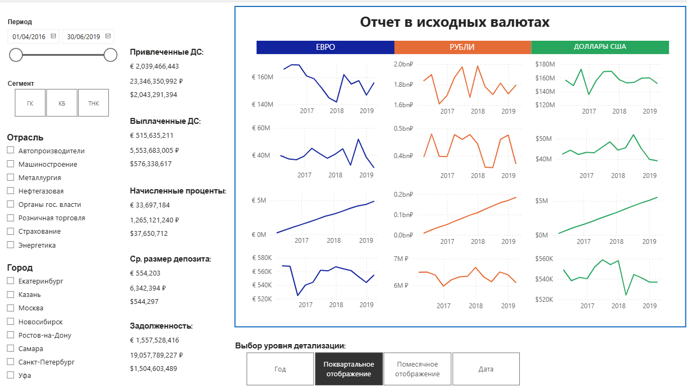
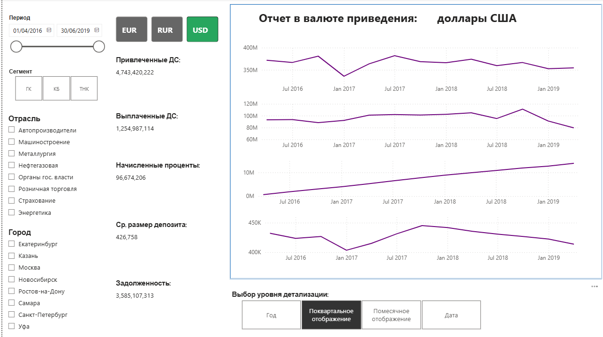
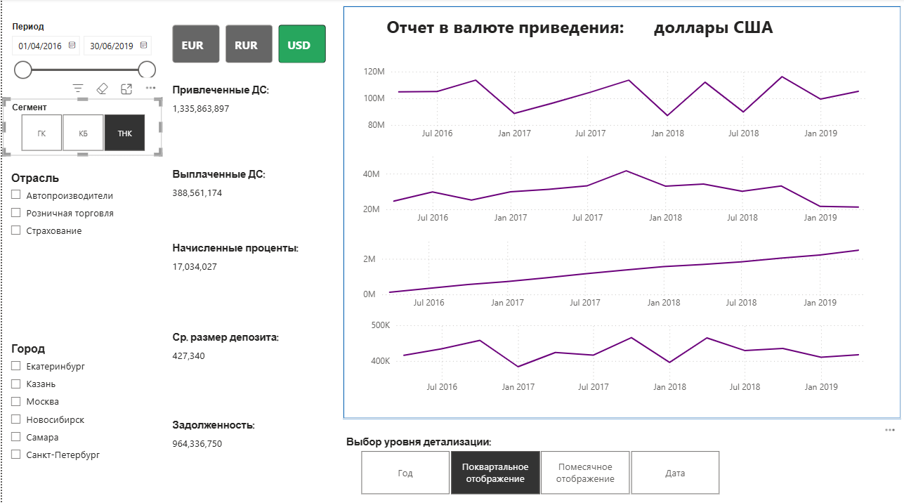
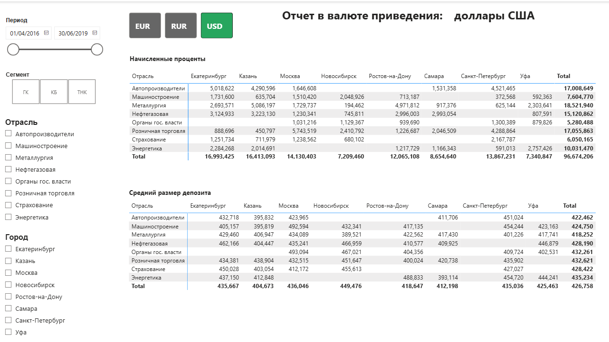
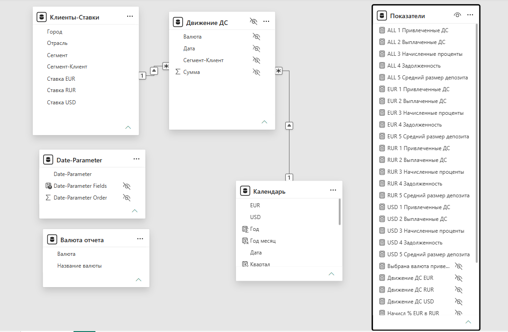

# Отчёт по привлечению денежных средств — Power BI

Дипломный проект по курсу «Power BI и Excel для продвинутых».

## О проекте

Отчёт для департамента пассивных операций банка: анализ привлечённых
и выплаченных денежных средств, начисленных процентов, задолженности
и среднего размера депозита по трём сегментам клиентов (ТНК, крупный
бизнес, государственные компании).

## Задача

Разработать интерактивный отчёт, который:
- рассчитывает 5 ключевых показателей деятельности департамента;
- поддерживает выбор периода, отрасли, сегмента, города;
- позволяет приводить показатели к одной валюте (рубли, доллары, евро);
- показывает динамику показателей с детализацией до дня;
- работает после обновления данных без ручных манипуляций.

## Данные

- **Движение ДС** — приходы и выплаты по депозитам (Excel, 3 сегмента).
- **Список клиентов** — реестр клиентов с отраслями, городами и ставками (PDF).
- **Курсы валют** — исторические данные ЦБ РФ (онлайн-источник).

## Что сделано

### Обработка данных
- Загрузила и преобразовала данные из Excel и PDF в табличный вид.
- Привела реестр клиентов из PDF-списка в нормализованную таблицу.
- Настроила автоматическое обновление курсов валют из онлайн-источника.

### Модель данных
- Построила звездообразную схему: таблицы фактов и измерений.
- Настроила связи по кратности и направлению фильтрации.
- Создала вспомогательные таблицы: календарь, справочник валют, справочник клиентов.

### Меры и расчёты (DAX)
- **Привлечённые ДС** — сумма приходов за период.
- **Выплаченные ДС** — сумма выплат за период.
- **Начисленные проценты** — посуточный расчёт от остатка на конец дня
  с учётом ставки и проверкой на овердрафт.
- **Задолженность** — привлечённые + начисленные − выплаченные.
- **Средний размер депозита** — привлечённые / число депозитов.
- Приведение к выбранной валюте через актуальный курс на конец периода.

### Визуализация
- KPI-карточки с ключевыми показателями на конец периода.
- Линейчатые диаграммы динамики с выбором уровня детализации.
- Матрица «показатель × отрасль/город».
- Срезы (slicers) для выбора периода, отрасли, сегмента, города, валюты.
- Настроено взаимодействие между визуализациями и кросс-фильтрация.

## Инструменты

- **Power BI Desktop** — разработка отчёта
- **Power Query (M)** — обработка и преобразование данных
- **DAX** — меры и вычисляемые столбцы
- **Excel** — исходные данные
- **PDF** — исходный реестр клиентов

## Скриншоты

### Главная страница отчёта

### Динамика показателей

### Фильтры и срезы

### Модель данных

## Файлы

- `deposit-report.pbix` — итоговый отчёт Power BI
- `screenshots/data-model.png` — схема модели данных

## Как открыть

1. Скачайте файл `deposit-report.pbix`.
2. Откройте в **Power BI Desktop** (бесплатная версия).
3. Для обновления данных настроить путь к исходным файлам.

## Что демонстрирует проект

- Обработка данных из разнородных источников (Excel, PDF, онлайн).
- Построение модели данных со связями по кратности и направлению.
- Расчёт сложных мер на DAX, включая посуточные начисления.
- Приведение мультивалютных показателей к единой валюте.
- Интерактивный отчёт с фильтрами и динамикой.
- Универсальность: отчёт работает после обновления данных без доработок.
